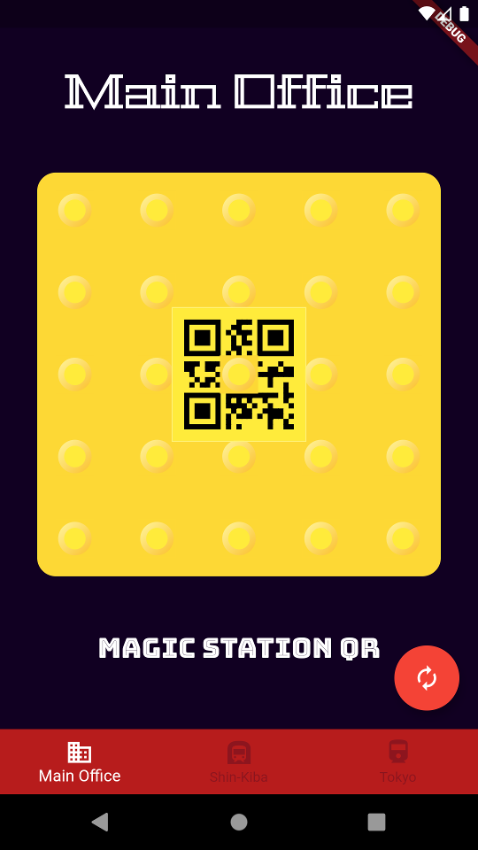

# magicstationqrgen

Magic 8 ball-inspired station QR code generator

## About

Playing with flutter.

## Screenshot

### Notes

Other background colors I liked:

- `Color(0xff737215)`
- `Color(0xff123456)`
